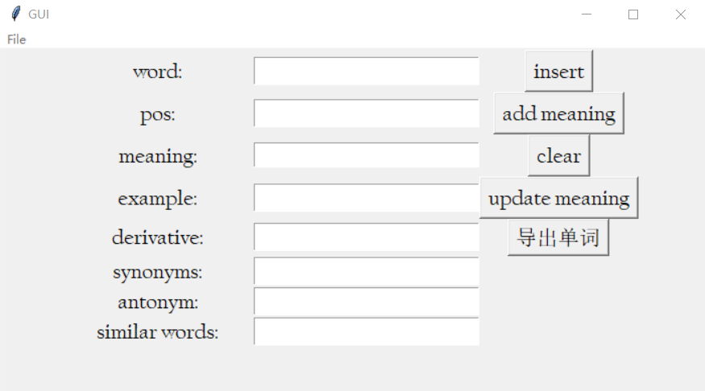
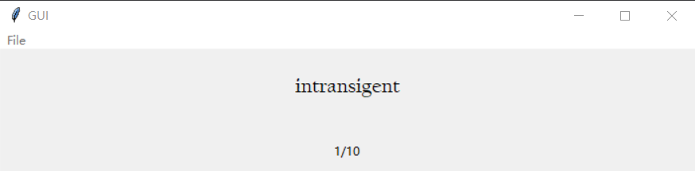
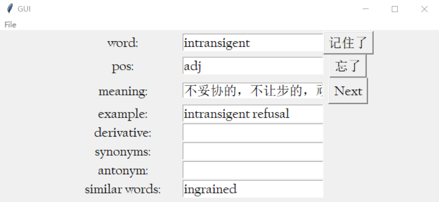

# word-management
## 介绍

这是一个可供用户自定义单词、含义、例句、同义词等属性的单词学习工具。使用自定义设置带来以下独特优点：

* 针对一词多义中的特定含义进行学习
* 熟词僻义
* 记录在阅读中遇到的实用例句
* 收录易混淆的单词
* 记录同义词，反义词
* 附加关于单词的其他笔记或注解

本项目主要由MySQL负责数据管理和Tkinter负责可视化界面实现。`sql_func.py` 文件用于存储与数据库相关的函数，包括但不限于数据库连接、单词插入等。`gui_demo.py` 文件负责可视化界面的实现。

## 使用说明

- 在可输入多项的字段（如“例句”）中，使用回车键分隔不同的项。
- 在复习模式中，按 `<Enter>` 跳至下一个单词，按 `<F>` 标记为“忘记”，按 `<space>` 标记为“记住”。
- 在单词发音的时候使用到了`gTTS`，需科学上网，第一次遇到该单词时需等待一段时间以获得`gTTS`的返回音频，后续则储存在本地。

## 待改进

- 当前某些参数是硬编码，未来将以配置文件的形式提供。
- 尚未实现基于艾宾济斯遗忘曲线的复习模式。
- 代码结构有待优化和模块化。

## 实现细节

### 数据库

数据库结构由下图所示：

1. **`examples` 表**：存储例句。
   - `example`: 例句（主键）
2. **`meanings` 表**：存储单词的各种含义。
   - `meaning`: 单词的含义（主键）
   - `note`: 注释或额外信息
3. **`pos` 表**：存储词性（Part of Speech）。
   - `pos`: 词性（主键）
4. **`relAntonym` 表**：存储反义词关系。
   - `relWordMeaningId`: 单词含义关联ID
   - `antonym`: 反义词
5. **`relDerivative` 表**：存储派生词关系。
   - `relWordMeaningId`: 单词含义关联ID
   - `derivative`: 派生词
6. **`relExample` 表**：存储例句关系。
   - `relWordMeaningId`: 单词含义关联ID
   - `example`: 例句
7. **`relSimilarWords` 表**：存储相似词关系。
   - `word`: 单词
   - `similarWord`: 相似的单词
8. **`relSynonyms` 表**：存储近义词关系。
   - `relWordMeaningId`: 单词含义关联ID
   - `synonyms`: 近义词
9. **`relWordMeaning` 表**：存储单词、词性和含义的关联。
   - `relWordMeaningId`: 单词含义关联ID（自动递增，主键）
   - `word`: 单词
   - `pos`: 词性
   - `meaning`: 含义
10. **`review_data` 表**：存储复习数据。
    - `id`: 唯一标识（自动递增，主键）
    - `word`: 单词
    - `review_date_gap`: 复习日期间隔
    - `continuous_remember_count`: 连续记住次数
    - `review_times`: 总复习次数
    - `forget_times`: 忘记次数
    - `remember`: 是否记得（布尔值）
11. **`words` 表**：存储单词及其复习信息。
    - `word`: 单词（主键）
    - `last_review_date`: 最后复习日期
    - `review_times`: 总复习次数
    - `continuous_remember_count`: 连续记住次数
    - `forget_times`: 忘记次数

此外，还有多个外键约束来维护这些表之间的关系。

### GUI

主界面：添加单词

复习界面：

